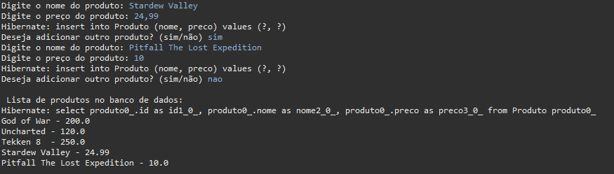
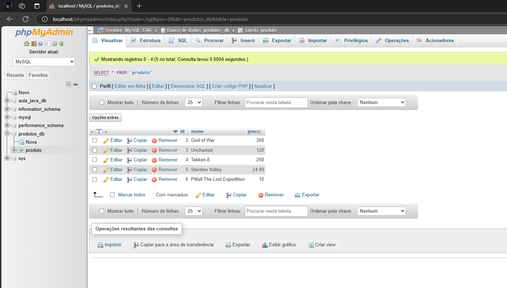

# JPA

Esta atividade é requisito da Avaliação Final

## 🚀 Começando


*CRIE UM PROJETO EM JAVA E REPRODUZA O EXEMPLO DO SOBRE O TEMA DA AULA DE JPA;

*REALIZAR A CONEXÃO WAMP-ECLIPSE DE FORMA MAIS SIMPLES;

*NO EXEMPLO, SERÁ NECESSÁRIO UTILIZAR O WAMP PARA ACESSO DO BANCO DE DADOS MYSQL;


[TESTE DO PROJETO ACIMA NO CONSOLE]

()


[TESTE DO PROJETO ACIMA NO PHPMYADMIN]

()


### 📋 Pré-requisitos

De que coisas você precisa para instalar o software e como instalá-lo?

```
Processador (AMD®, ARM® ou Intel®) de 64 bits.
Por consequência, um sistema operacional de 64 bits;
Espaço em disco suficiente para baixar e instalar os componentes da IDE(Não é muito pesado).


1. Faça o Download do Eclipse Installer.
2. Inicie o Eclipse Installer.
3. Selecione o pacote (Linguagem de Programação) para baixar.
4. Selecione um Local para guardar Downloads.
5. E Pronto!

```

### 🔧 Instalação

A partir da conexão do Servidor WAMP com o Eclipse, se criou uma classe que, através do Eclipse IDE implementa informações diretamente no banco de dados criado no servidor WAMP.

## 🛠️ Construído com

* IDE Eclipse
* JRE System Library
* Maven Dependencies
* WAMP SERVER

## 📌 Versão

* **Eclipse Installer 2024-09 R
* WAMP SERVER 3.3.5
  
